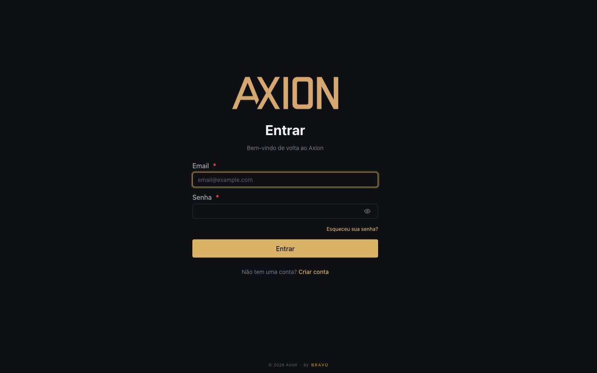

# Axion

Axion is a trading journal and analytics SaaS. It replaces spreadsheet-based trade logs with a real statistical engine: log every trade, then see the numbers that actually predict edge, not just win rate.

**Live:** [axion-bravo.vercel.app](https://axion-bravo.vercel.app)



I designed and built Axion end-to-end, alone: product decisions, database schema, statistical engine, and UI.

## What it does

- **Trade logging with OCR import.** Upload a broker screenshot and Axion extracts the trade data automatically. A cascading fallback across OpenAI, Google Vision, Claude, Groq, and Tesseract means one provider going down does not block an import.
- **Statistical simulation engine.** Runs configurable simulations over your trade history, models day-of-week effects, and reports probability distributions instead of a single average.
- **Aggregation dashboards.** Server-computed charts, heatmaps, and filterable time series, so the heavy computation runs on the server, not the browser.
- **Multi-account support.** Each account's data is isolated and encrypted at rest.

## Tech stack

### Frontend

- Next.js 16 (App Router)
- React 19 (Server Components)
- TypeScript, strict mode
- Tailwind CSS 4
- Shadcn/ui
- Recharts

### Backend

- Drizzle ORM
- PostgreSQL (Neon serverless)
- Server Actions
- Zod validation

### Tooling

- ESLint, Prettier
- pnpm
- Turbopack

## Run it locally

Prerequisites: Node.js 18+, pnpm, a PostgreSQL database (Neon recommended).

1. Clone the repository:
   ```bash
   git clone https://github.com/YgorBravimR/axion.git
   cd axion
   ```
2. Install dependencies:
   ```bash
   pnpm install
   ```
3. Create a `.env` file in the root with your database connection string:
   ```env
   DATABASE_URL="your_postgresql_connection_string"
   ```
4. Push the schema:
   ```bash
   pnpm drizzle-kit push
   ```
5. Start the dev server:
   ```bash
   pnpm dev
   ```
6. Open [http://localhost:3000](http://localhost:3000).

## License

MIT
