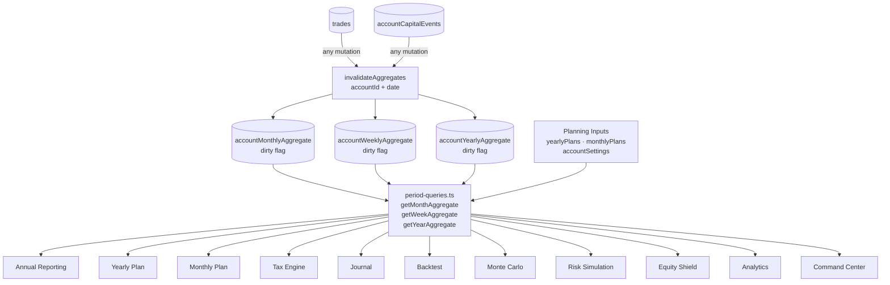

# Annual Reporting — Design Spec

**Date:** 2026-05-03  
**Status:** Draft  
**Sub-project:** Annual Reporting (Weekly Meta vs Real chart + Annual Rollup table)  
**Route:** extends `/reports`

---

## 1. Overview

Annual Reporting adds two high-signal views to the `/reports` page that currently only shows weekly/monthly snapshots and cost analyses:

1. **Weekly Meta vs Real chart** — a combo line/bar chart spanning all ISO weeks of the current year, plotting gross target (Meta Bruto), net target (Meta Líquido), actual result (Resultado), and the configurable auto-withdrawal projection side by side. Traders can instantly see which weeks they beat the plan, fell short, or over-performed.

2. **Annual Rollup table** — a 12-row × 14-column matrix (Jan through Dez + totals row) that mirrors the "Relatório Anual" tab from the legacy Excel workbook. Each row shows the full P&L and capital lifecycle for a month: gross/net result, points, fee breakdown, starting capital, carryover patrimônio, gain/loss day counts, plan targets, deposits, withdrawals, and ending balance.

Together these surfaces close the gap between day-to-day journaling and year-end self-assessment. They answer the question a trader asks once a month: "Am I on pace?" and the question asked once a year: "Did I grow capital responsibly?"

---

## 2. Assumptions

- **Yearly Plan sub-project** will land before or in parallel. `yearlyPlans` and `weeklyTargets` tables are assumed to exist and supply `metaBruto` and `metaLiquido` per ISO week. This spec treats those as required inputs, not optional.
- **Tax Engine sub-project** will land before or in parallel. A `monthlyTaxLedger` table (or equivalent) is assumed to supply `taxAmountCents` and `feesAmountCents` per account × year × month. Until it lands, the annual rollup derives tax as `netPnl * dayTradeTaxRate / 100` using the account's existing rate, and marks the column "estimated".
- `monthlyPlans` already stores `accountBalance` (the capital base for a given month). This is the proxy for "Aporte Inicial" at plan-creation time.
- There is **no** `accountCapitalEvents` table in the current schema. Deposits and withdrawals have no explicit record. A new table is required (see §5).
- The "Mês Anterior" (carryover patrimônio) value is computed at read time: `patrimônio(month N) = patrimônio(month N-1) + netPnl(month N) + deposits(month N) - withdrawals(month N)`.
- Prop-firm accounts: `aporte` / `retirada` columns are hidden for `accountType = 'prop'` because capital belongs to the firm. The table still shows trading P&L.
- Multi-account: default view aggregates across all user accounts (matching the `showAllAccounts` logic already in `reports.ts`). A per-account dropdown filter will be added.
- Currency: BRL throughout (matches `defaultCurrency`). No conversion logic needed.
- The spec is scoped to the **current year** only on first load. A year-picker can select prior years.
- "Pontos" in the rollup maps to summing the `points` field on `trades` (assumed to exist — confirm schema).
- **Account start anchor**: all patrimônio calculations and table rendering are anchored on `tradingAccounts.accountStartMonth` / `accountStartYear`. Months before the account start date render as blank/disabled rows. If unset, all months are shown (legacy behaviour).
- **Withdrawal rule**: configurable per account via `tradingAccounts.withdrawalTargetPercent` (default "30.00"). Null or 0 disables the withdrawal line/calculator entirely.

---

## 3. Cross-Feature Integration Architecture

This section describes the canonical data flow that connects every feature in Axion. Annual Reporting is not a standalone feature — it is a **consumer of a shared read layer** that all features use. The goal is zero data duplication, one write path, and fast reads everywhere.

### 3.1 Canonical Data Flow

```
 ┌─────────────┐     write      ┌──────────────────┐
 │   trades    │ ─────────────► │  invalidation    │
 │  (raw fact  │                │  (dirty flags on  │
 │   table)    │                │  month/week/year) │
 └─────────────┘                └──────────────────┘
        │                                │
        │  triggers                      │ async or sync
        ▼                                ▼
 ┌───────────────────────────────────────────────────┐
 │          Materialized Aggregate Tables            │
 │  accountMonthlyAggregate  (accountId, year, month)│
 │  accountWeeklyAggregate   (accountId, year, week) │
 │  accountYearlyAggregate   (accountId, year)       │
 └───────────────────────────────────────────────────┘
        │
        │  read via period-queries.ts
        ▼
 ┌───────────────────────────────────────────────────┐
 │              Read-Side Query Layer                │
 │  src/lib/queries/period-queries.ts                │
 │  getMonthAggregate(accountId, y, m)               │
 │  getWeekAggregate(accountId, y, w)                │
 │  getYearAggregate(accountId, y)                   │
 └───────────────────────────────────────────────────┘
        │
        │  consumed by
        ▼
 ┌─────────────────────────────────────────────────────────────────────┐
 │                       Feature Consumers                             │
 │  Annual Reporting · Yearly Plan · Monthly Plan · Tax Engine         │
 │  Journal · Backtest · Monte Carlo · Risk Simulation · Equity Shield │
 │  Analytics · Command Center                                         │
 └─────────────────────────────────────────────────────────────────────┘
        ▲
        │  user inputs feed projections
 ┌──────────────────────┐
 │  Planning inputs     │
 │  (yearlyPlans,       │
 │   monthlyPlans,      │
 │   accountSettings)   │
 └──────────────────────┘
```

**Mermaid diagram:**



### 3.2 Shared Modules

These modules are the single source of truth for cross-feature logic. No feature may replicate this logic inline.

#### `src/lib/contracts/point-values.ts`

Asset-aware money ↔ points conversion.

```typescript
// Maps asset instrument to its tick/point value in BRL
const POINT_VALUES: Record<string, number> = {
  WIN: 0.20,   // Mini Índice — R$0.20 per point
  WDO: 10.00,  // Mini Dólar — R$10.00 per point
  // extend as new instruments are added
}

/**
 * Converts points to BRL for a given instrument and contract count.
 * @param points - raw point delta
 * @param instrument - e.g. "WIN", "WDO"
 * @param contracts - number of contracts (default 1)
 */
const pointsToCents = (points: number, instrument: string, contracts = 1): number =>
  Math.round(points * (POINT_VALUES[instrument] ?? 1) * contracts * 100)

/**
 * Converts BRL cents to points for a given instrument and contract count.
 */
const centsToPoints = (cents: number, instrument: string, contracts = 1): number =>
  cents / ((POINT_VALUES[instrument] ?? 1) * contracts * 100)

export { POINT_VALUES, pointsToCents, centsToPoints }
```

#### `src/lib/calendar/iso-week.ts`

Consistent ISO week numbering used by every feature. Wraps `date-fns` to avoid scattered inline calls.

```typescript
import { getISOWeek, getISOWeekYear, getISOWeeksInYear, startOfISOWeek, endOfISOWeek } from "date-fns"

const getWeekNumber = (date: Date): number => getISOWeek(date)
const getWeekYear = (date: Date): number => getISOWeekYear(date)
const getWeeksInYear = (year: number): number => getISOWeeksInYear(new Date(year, 6, 1))
const weekStart = (date: Date): Date => startOfISOWeek(date)
const weekEnd = (date: Date): Date => endOfISOWeek(date)

export { getWeekNumber, getWeekYear, getWeeksInYear, weekStart, weekEnd }
```

#### `src/lib/aggregation/period-rollup.ts`

**The one function every feature calls to collapse raw trades into period totals.** No feature accesses `trades` directly for aggregation — they all call this.

```typescript
import type { PeriodResult } from "@/types/integration"
import type { Trade } from "@/types/trade"

interface RollupOptions {
  /** ISO year */
  year: number
  /** 1–12 for monthly, undefined for yearly */
  month?: number
  /** ISO week number, undefined unless weekly rollup */
  isoWeek?: number
}

/**
 * Rolls an array of pre-filtered trades into a single PeriodResult.
 * Caller is responsible for filtering trades to the correct period + account.
 * This function only aggregates — it does not query the DB.
 */
const rollupTrades = (trades: Trade[], _opts: RollupOptions): PeriodResult => {
  let grossCents = 0
  let netCents = 0
  let totalPoints = 0
  const gainDays = new Set<string>()
  const lossDays = new Set<string>()

  for (const trade of trades) {
    grossCents += trade.pnlCents + (trade.commissionCents ?? 0) + (trade.feesCents ?? 0)
    netCents += trade.pnlCents
    totalPoints += trade.points ?? 0

    const dayKey = trade.entryDate.toISOString().slice(0, 10)
    // Day-level gain/loss determined by net sum (computed separately if needed)
    if (trade.pnlCents > 0) gainDays.add(dayKey)
    else if (trade.pnlCents < 0) lossDays.add(dayKey)
  }

  return {
    grossCents,
    netCents,
    points: totalPoints,
    tradingDays: gainDays.size + lossDays.size,
    gainDays: gainDays.size,
    lossDays: lossDays.size,
  }
}

export { rollupTrades }
export type { RollupOptions }
```

### 3.3 Shared Types — `src/types/integration.ts`

```typescript
/**
 * The canonical shape for any rolled-up trading period (week / month / year).
 * Every feature that reads aggregated P&L works with this type.
 */
interface PeriodResult {
  grossCents: number
  netCents: number
  points: number
  tradingDays: number
  gainDays: number
  lossDays: number
}

/**
 * A planning target for a period — three views of the same goal.
 */
interface MetaTarget {
  grossCents: number
  netCents: number
  points: number
}

/**
 * Snapshot of account capital at a point in time.
 * Used by Annual Reporting, Equity Shield, Monte Carlo, and Yearly Plan.
 */
interface CapitalSnapshot {
  /** Balance in cents at the snapshot moment */
  balanceCents: number
  /** Ordered history of capital events that produced this balance */
  events: CapitalEvent[]
}

interface CapitalEvent {
  id: string
  eventType: "deposit" | "withdrawal"
  amountCents: number
  eventDate: string   // ISO date "YYYY-MM-DD"
  notes?: string
}

export type { PeriodResult, MetaTarget, CapitalSnapshot, CapitalEvent }
```

### 3.4 Materialized Aggregate Tables

**Recommendation: materialized tables with dirty-flag invalidation** over an event-bus pattern.

Rationale:
- Event bus (pub/sub) adds latency and out-of-order risk. For a journaling app reads happen at page load time — consistency matters more than sub-second propagation.
- Materialized tables give instant reads. Any feature opens a page and gets pre-computed aggregates in one indexed lookup.
- Dirty-flag pattern is simple: when a trade is written/edited/deleted, mark the affected month, week, and year as dirty. A background job (or synchronous recompute on next read) refreshes only dirty rows.

#### `accountMonthlyAggregate`

```sql
CREATE TABLE account_monthly_aggregate (
  account_id    UUID NOT NULL REFERENCES trading_accounts(id) ON DELETE CASCADE,
  year          SMALLINT NOT NULL,
  month         SMALLINT NOT NULL,  -- 1–12
  gross_cents   BIGINT NOT NULL DEFAULT 0,
  net_cents     BIGINT NOT NULL DEFAULT 0,
  points        NUMERIC(12,2) NOT NULL DEFAULT 0,
  trading_days  SMALLINT NOT NULL DEFAULT 0,
  gain_days     SMALLINT NOT NULL DEFAULT 0,
  loss_days     SMALLINT NOT NULL DEFAULT 0,
  is_dirty      BOOLEAN NOT NULL DEFAULT true,
  computed_at   TIMESTAMPTZ,
  PRIMARY KEY (account_id, year, month)
);
```

#### `accountWeeklyAggregate`

```sql
CREATE TABLE account_weekly_aggregate (
  account_id    UUID NOT NULL REFERENCES trading_accounts(id) ON DELETE CASCADE,
  iso_year      SMALLINT NOT NULL,
  iso_week      SMALLINT NOT NULL,  -- 1–53
  gross_cents   BIGINT NOT NULL DEFAULT 0,
  net_cents     BIGINT NOT NULL DEFAULT 0,
  points        NUMERIC(12,2) NOT NULL DEFAULT 0,
  trading_days  SMALLINT NOT NULL DEFAULT 0,
  gain_days     SMALLINT NOT NULL DEFAULT 0,
  loss_days     SMALLINT NOT NULL DEFAULT 0,
  is_dirty      BOOLEAN NOT NULL DEFAULT true,
  computed_at   TIMESTAMPTZ,
  PRIMARY KEY (account_id, iso_year, iso_week)
);
```

A yearly aggregate row is derived on demand by summing monthly rows (no separate table needed in v1).

### 3.5 Write-Side Invalidation

Any mutation to `trades` or `accountCapitalEvents` calls:

```typescript
// src/lib/aggregation/invalidate.ts

import { getWeekNumber, getWeekYear } from "@/lib/calendar/iso-week"

/**
 * Marks the month and ISO week containing `date` as dirty for `accountId`.
 * Called by every trade write path (create, update, delete).
 * Tax Engine subscribes to the same dirty flag — no separate invalidation needed.
 */
const invalidateAggregates = async (accountId: string, date: Date): Promise<void> => {
  const year = date.getFullYear()
  const month = date.getMonth() + 1
  const isoWeek = getWeekNumber(date)
  const isoYear = getWeekYear(date)

  await Promise.all([
    db
      .insert(accountMonthlyAggregate)
      .values({ accountId, year, month, isDirty: true })
      .onConflictDoUpdate({ target: [accountMonthlyAggregate.accountId, accountMonthlyAggregate.year, accountMonthlyAggregate.month], set: { isDirty: true } }),
    db
      .insert(accountWeeklyAggregate)
      .values({ accountId, isoYear, isoWeek, isDirty: true })
      .onConflictDoUpdate({ target: [accountWeeklyAggregate.accountId, accountWeeklyAggregate.isoYear, accountWeeklyAggregate.isoWeek], set: { isDirty: true } }),
  ])
}

export { invalidateAggregates }
```

### 3.6 Read-Side Query Layer — `src/lib/queries/period-queries.ts`

Every feature reads through this layer. No feature reaches into `trades` directly for aggregation.

```typescript
// Signatures — implementation computes from aggregate tables (recomputing dirty rows first)

/**
 * Returns the monthly aggregate for a given account/year/month.
 * If the row is dirty, recomputes from raw trades before returning.
 */
const getMonthAggregate = async (
  accountId: string,
  year: number,
  month: number
): Promise<PeriodResult>

/**
 * Returns the weekly aggregate for a given account/ISO year/ISO week.
 * If the row is dirty, recomputes from raw trades before returning.
 */
const getWeekAggregate = async (
  accountId: string,
  isoYear: number,
  isoWeek: number
): Promise<PeriodResult>

/**
 * Returns the yearly aggregate by summing all monthly rows for the year.
 * Recomputes any dirty months first.
 */
const getYearAggregate = async (
  accountId: string,
  year: number
): Promise<PeriodResult>

export { getMonthAggregate, getWeekAggregate, getYearAggregate }
```

### 3.7 Mensal Máximo Formula

`MensalMáximo` is derived from the Yearly Plan's capital ladder, not a fixed multiplier on `mensalEsperado`.

```
MensalMáximo(month) =
  maxContracts(capitalTier) × pointValue(instrument) × maxIdealHitRate × pointsPerSession × sessionsPerMonth

Where:
  capitalTier          = the capital bracket the account falls into for that month
                         (defined in yearlyPlans.capitalLadder — e.g. R$10k → 1 contract,
                          R$20k → 2 contracts, etc.)
  maxContracts         = max contracts allowed for the account's capital tier
  pointValue           = instrument tick value in BRL (from point-values.ts)
  maxIdealHitRate      = 0.80  (80% of sessions are profitable — conservative ceiling)
  pointsPerSession     = average points target per session at this capital tier
                         (sourced from yearlyPlans.dailyPointsTarget)
  sessionsPerMonth     = 20   (standard trading month)
```

In practice, for the first implementation, derive it as:

```
MensalMáximo = mensalEsperado × (maxContracts / plannedContracts) × maxIdealHitRate / plannedHitRate
```

If `yearlyPlans` data is absent, fall back to `mensalEsperado × 1.5` (capped multiplier) and mark with `†` footnote: "Estimated ceiling — set a yearly plan for exact maximum."

---

## 4. User Stories

**Story 1 — End-of-month review (solo trader)**
> As a solo trader, after closing the last trading session of the month, I open `/reports` and scroll to the Annual Rollup. I see whether my Resultado Líquido for the month hit or exceeded Mensal Esperado. If yes, I navigate to the Withdrawal Calculator and it tells me: "You earned R$4.200 net. Based on your 30% withdrawal target, consider withdrawing R$1.260." I click "Log Withdrawal", enter the amount, and the table updates Retirada for the month immediately.

**Story 2 — Weekly check-in (mentorship student)**
> As a TAT mentorship student mid-year, I open the Weekly Meta vs Real chart and see that weeks 1–8 tracked the Meta Líquido line closely but weeks 9–12 fell short by 30%. I notice the pattern aligns with a period I know I deviated from strategy. I use this as evidence when writing my monthly accountability note.

**Story 3 — Partial year / account start**
> I set my account start to March. The Annual Rollup shows January and February rows as blank/disabled (greyed out, non-interactive). March is the first row with real numbers. The year-total row correctly ignores the disabled months. The Weekly Meta vs Real chart only shows bars from ISO week 9 onward (the first week of March).

**Story 4 — Year-end summary**
> At the end of December, I open the Annual Rollup and see the totals row. Patrimônio final shows my net capital growth for the year. I screenshot it for my tax accountant.

**Story 5 — Configurable withdrawal**
> I set my withdrawal target to 20% in Settings. The WithdrawalCalculator now suggests 20% of net profit. I set another account's withdrawal target to 0 (disabled). That account's reports page shows no withdrawal line on the chart and no WithdrawalCalculator component.

---

## 5. Data Model

### `tradingAccounts` — new columns

Add three new columns to `tradingAccounts` to anchor the account lifecycle and configure the withdrawal rule.

```typescript
// In schema.ts, extend tradingAccounts table with:

/** First month the account was active. Used to hide pre-start months in all views. */
accountStartMonth: smallint("account_start_month"),  // 1–12, nullable

/** First year the account was active. */
accountStartYear: smallint("account_start_year"),    // e.g. 2025, nullable

/**
 * Opening balance in cents at account start.
 * Seeds the patrimônio chain for the first active month (replaces reliance on
 * monthlyPlans.accountBalance for the January/first-month anchor).
 */
startingBalanceCents: bigint("starting_balance_cents", { mode: "number" }),  // nullable

/**
 * Percentage of net profit to target for withdrawal each month.
 * Stored as a numeric string for precision (e.g. "30.00").
 * Null or "0" disables the withdrawal line and WithdrawalCalculator entirely.
 * Default: "30.00"
 */
withdrawalTargetPercent: numeric("withdrawal_target_percent", { precision: 5, scale: 2 }).default("30.00"),
```

**SQL migration:**

```sql
ALTER TABLE trading_accounts
  ADD COLUMN account_start_month  SMALLINT CHECK (account_start_month BETWEEN 1 AND 12),
  ADD COLUMN account_start_year   SMALLINT,
  ADD COLUMN starting_balance_cents BIGINT,
  ADD COLUMN withdrawal_target_percent NUMERIC(5,2) DEFAULT 30.00;
```

**Cascading effect on Annual Reporting:**
- `getAnnualRollup` checks `account.accountStartMonth` / `accountStartYear`. Any `month < accountStartMonth` (within `accountStartYear`) or `year < accountStartYear` returns a row with `{ hasTrades: false, disabled: true }`.
- `AnnualRollupTable` renders disabled rows with `opacity-30` and no interactive elements (no delete, no log withdrawal).
- `WeeklyMetaChart` filters out ISO weeks whose `weekStart` falls before the account start date.
- **Yearly Plan** applies the same guard — no capital ladder row rendered for pre-start months.

**Cascading effect on WithdrawalCalculator:**
- If `withdrawalTargetPercent` is null or "0", `WithdrawalCalculator` does not render. The withdrawal projection line is absent from `WeeklyMetaChart`.
- The `autoRetirada` field on `WeeklyMetaRow` is computed as `resultado * (withdrawalTargetPercent / 100)` when `withdrawalTargetPercent > 0`, else `0`.

**Settings UI additions:**

New "Account" sub-section in `/settings` (or existing account settings panel):

| Field | Input | Validation |
|---|---|---|
| Account Start Month | `<select>` (Jan–Dec) | Required if Start Year is set |
| Account Start Year | `<input type="number">` | ≥ 2000, ≤ current year |
| Opening Balance | Amount input (BRL) | > 0 if provided |
| Monthly Withdrawal Target | `<input type="number">` (percentage) | 0–100, step 0.01. 0 = disabled |

### New table: `accountCapitalEvents`

Required because `tradingAccounts` has no deposit/withdrawal history and `monthlyPlans.accountBalance` only records the starting balance at plan creation, not intra-month movements.

**No encryption.** `amountCents` is stored as a plain `BIGINT` integer. This is consistent with how `trades.pnlCents` is stored — no application-layer encryption. Database-level encryption (transparent disk encryption) is the assumed mechanism at the infrastructure level.

```sql
CREATE TABLE account_capital_events (
  id          UUID PRIMARY KEY DEFAULT gen_random_uuid(),
  account_id  UUID NOT NULL REFERENCES trading_accounts(id) ON DELETE CASCADE,
  event_type  TEXT NOT NULL CHECK (event_type IN ('deposit', 'withdrawal')),
  amount_cents BIGINT NOT NULL,         -- always positive; direction implied by event_type
  event_date  DATE NOT NULL,            -- actual transfer date (not log date)
  notes       TEXT,
  created_at  TIMESTAMPTZ NOT NULL DEFAULT now(),
  updated_at  TIMESTAMPTZ NOT NULL DEFAULT now()
);
CREATE INDEX ace_account_date_idx ON account_capital_events(account_id, event_date);
```

**Drizzle schema addition** (in `schema.ts`):

```typescript
export const capitalEventTypeEnum = pgEnum("capital_event_type", ["deposit", "withdrawal"])

export const accountCapitalEvents = pgTable(
  "account_capital_events",
  {
    id: uuid("id").primaryKey().defaultRandom(),
    accountId: uuid("account_id")
      .notNull()
      .references(() => tradingAccounts.id, { onDelete: "cascade" }),
    eventType: capitalEventTypeEnum("event_type").notNull(),
    amountCents: bigint("amount_cents", { mode: "number" }).notNull(),  // plain integer, no encryption
    eventDate: timestamp("event_date", { withTimezone: false }).notNull(),
    notes: text("notes"),
    createdAt: timestamp("created_at", { withTimezone: true }).defaultNow().notNull(),
    updatedAt: timestamp("updated_at", { withTimezone: true }).defaultNow().notNull(),
  },
  (table) => [
    index("ace_account_date_idx").on(table.accountId, table.eventDate),
  ]
)
```

### Reuse (no changes needed)

- `trades` — source of Resultado Bruto (sum of `pnl + commission + fees`), Resultado Líquido (sum of `pnl`), Pontos (sum of `points`), Dias de Gain/Loss (count of unique `entryDate` days where daily sum > 0 / < 0).
- `monthlyPlans` — source of `accountBalance` (Aporte Inicial proxy), `dailyProfitTargetCents` → derives Mensal Esperado.
- `weeklyTargets` (Yearly Plan spec) — source of Meta Bruto / Meta Líquido per week.
- `tradingAccounts` — `dayTradeTaxRate` for tax estimation fallback; `withdrawalTargetPercent` for withdrawal line/calculator; `accountStartMonth` / `accountStartYear` for period gating.

### Computation note

Patrimônio is a running total, not stored. Computed left-to-right, anchored at account start:

```
// If month is the first active month (accountStartMonth in accountStartYear):
patrimônio[start] = startingBalanceCents + netPnl[start] - retirada[start]

// For subsequent months:
patrimônio[N] = patrimônio[N-1] + netPnl[N] + deposito[N] - retirada[N]
```

"Mês Anterior" column = `patrimônio[N-1]` (prior month's closing balance). For the first active month, "Mês Anterior" = `startingBalanceCents` (the opening balance set in settings).

---

## 6. Server Actions

New file: `src/app/actions/annual-reports.ts`

```typescript
// Signatures only — no implementation in this spec

/**
 * Returns all ISO weeks for `year` with their Meta Bruto, Meta Líquido,
 * Resultado (actual net P&L), and configurable auto-retirada projection.
 * Gracefully returns null for Meta fields if yearlyPlans data is absent.
 * Filters weeks before account start date to null resultado (disabled).
 */
export const getWeeklyMetaVsReal = async (
  year: number
): Promise<{
  status: "success" | "error"
  data?: WeeklyMetaVsRealData
  message?: string
}>

/**
 * Returns 12 monthly rows + a totals row for the annual rollup table.
 * Months before accountStartMonth/Year have disabled: true and null values.
 * Delegates to getMonthAggregate() from period-queries.ts for each row.
 */
export const getAnnualRollup = async (
  year: number
): Promise<{
  status: "success" | "error"
  data?: AnnualRollupData
  message?: string
}>

/**
 * Logs a deposit or withdrawal for the authenticated user's active account.
 * Validates: amountCents > 0, eventDate not in future, eventType enum.
 * Calls invalidateAggregates() after successful write.
 */
export const recordCapitalEvent = async (params: {
  eventType: "deposit" | "withdrawal"
  amountCents: number
  eventDate: string   // ISO date string "YYYY-MM-DD"
  notes?: string
}): Promise<{
  status: "success" | "error"
  data?: { id: string }
  message?: string
}>

/**
 * Deletes a capital event by ID (soft validation: must belong to current user's account).
 * Calls invalidateAggregates() after successful delete.
 */
export const deleteCapitalEvent = async (
  id: string
): Promise<{ status: "success" | "error"; message?: string }>
```

### Key type shapes

```typescript
interface WeeklyMetaRow {
  isoWeek: number           // 1–52/53
  weekStart: string         // "YYYY-MM-DD"
  weekEnd: string           // "YYYY-MM-DD"
  metaBruto: number | null  // null if no yearly plan
  metaLiquido: number | null
  resultado: number         // actual net P&L; 0 if week is before account start
  autoRetirada: number      // resultado * (withdrawalTargetPercent/100) when > 0; 0 if withdrawal disabled
  disabled: boolean         // true for weeks before account start
}

interface WeeklyMetaVsRealData {
  year: number
  hasPlan: boolean
  withdrawalTargetPercent: number | null  // null = disabled
  weeks: WeeklyMetaRow[]
}

interface AnnualRollupRow {
  month: number           // 1–12
  monthName: string
  disabled: boolean       // true for months before account start date
  resultadoBruto: number | null
  resultadoLiquido: number | null
  pontos: number | null
  taxas: number | null
  imposto: number | null   // null = not available; estimated flag on parent
  impostoEstimated: boolean
  aporteInicial: number | null
  mesAnterior: number | null  // prior month patrimônio; startingBalanceCents for first active month
  diasGain: number
  diasLoss: number
  mensalEsperado: number | null
  mensalMaximo: number | null  // see §3.7 for formula
  novoAporte: number      // sum of deposits in month
  retirada: number        // sum of withdrawals in month
  capitalInvestido: number | null  // mesAnterior + novoAporte
  patrimonio: number | null   // capitalInvestido + resultadoLiquido - retirada
  hasTrades: boolean
}

interface AnnualRollupData {
  year: number
  rows: AnnualRollupRow[]  // 12 entries
  totals: Omit<AnnualRollupRow, "month" | "monthName" | "mesAnterior" | "impostoEstimated" | "hasTrades" | "disabled">
  taxEstimated: boolean    // true if Tax Engine data was unavailable
  withdrawalTargetPercent: number | null  // passed through for WithdrawalCalculator
}
```

---

## 7. Integration Contracts

Annual Reporting acts as both a **consumer** and a **definer** of the shared read layer described in §3. The integration contracts this feature establishes for the rest of the system are:

### What Annual Reporting reads (inputs)

| Source | Via | Fields consumed |
|---|---|---|
| `trades` | `getMonthAggregate()` | grossCents, netCents, points, gainDays, lossDays |
| `accountCapitalEvents` | `getMonthAggregate()` | deposits, withdrawals per month |
| `weeklyTargets` | `getWeekAggregate()` | metaBrutoCents, metaLiquidoCents |
| `monthlyPlans` | direct query | dailyProfitTargetCents, accountBalance |
| `tradingAccounts` | direct query | withdrawalTargetPercent, accountStartMonth/Year, startingBalanceCents, dayTradeTaxRate |
| `monthlyTaxLedger` | direct query (if available) | taxAmountCents, feesAmountCents |

### What Annual Reporting provides (outputs for other features)

Annual Reporting does not expose its own query API — it reads from `period-queries.ts`. However, the `accountCapitalEvents` table it introduces is consumed by:

- **Equity Shield**: uses deposit/withdrawal history to compute real capital exposure
- **Monte Carlo**: uses `CapitalSnapshot` to initialize simulation starting balance
- **Yearly Plan**: uses starting balance + events to display actual vs planned capital ladder

### Aggregate table ownership

Annual Reporting is the **first feature** to depend on `accountMonthlyAggregate` and `accountWeeklyAggregate`. It is responsible for:
1. Defining the schema (see §3.4)
2. Establishing the `invalidateAggregates` write hook (see §3.5)
3. Implementing `period-queries.ts` (see §3.6)

All subsequent features inherit these without re-implementing them.

---

## 8. Routes & Pages

### Integration point: extend `/reports/page.tsx`

The page already fetches four data blobs in parallel. Extend the `Promise.all` with two new calls:

```typescript
const [weeklyResult, monthlyResult, mistakeResult, feeResult, annualRollupResult, weeklyMetaResult] =
  await Promise.all([...existing..., getAnnualRollup(currentYear), getWeeklyMetaVsReal(currentYear)])
```

Pass results down to `ReportsContent`.

### Layout change in `ReportsContent`

The current layout is a single `space-y` stack. The annual sections are visually heavy and belong **below** the existing four cards. Add them as a clearly delineated section:

```
┌─────────────────────────────────────────────────────┐
│  [Weekly Report Card]   [Monthly Report Card]       │  ← existing
├─────────────────────────────────────────────────────┤
│  [Mistake Cost Card]                                │  ← existing
├─────────────────────────────────────────────────────┤
│  [Commission Fee Impact Card]                       │  ← existing
├─────────────────────────────────────────────────────┤
│  Annual section heading + year picker               │  ← new
│  [WeeklyMetaChart]                                  │  ← new
│  [AnnualRollupTable]                                │  ← new
│  [CapitalEventLog] (collapsible)                    │  ← new
└─────────────────────────────────────────────────────┘
```

No new route. No tab system. Consistent with how existing cards are stacked. The annual section heading uses a `text-label text-txt-200 uppercase tracking-wider` style with an `acc-100`-colored left border strip, matching the visual hierarchy already established in the dashboard.

A **year picker** (`<select>` styled with Tailwind, not a full datepicker) sits in the heading row, right-aligned. It populates with years that have at least one trade, defaulting to the current year.

---

## 9. Components

### `WeeklyMetaChart`

- **Location:** `src/components/reports/weekly-meta-chart.tsx`
- **Type:** client component (`"use client"`)
- **Chart:** Recharts `ComposedChart` — `Bar` for Resultado (green/red based on sign), `Line` for Meta Bruto (gold `acc-100` dashed), `Line` for Meta Líquido (blue `acc-200` dashed), `Line` for withdrawal projection (muted gold, dotted — only rendered when `withdrawalTargetPercent > 0`). Disabled weeks render as empty/greyed bars. Uses `ChartContainer` from `ui/chart-container.tsx`.
- **Axes:** X = ISO week number ("W1"…"W52"). Y = BRL (compact format: "R$1.2k"). Right Y-axis optional for point scale — deprioritize for v1.
- **Tooltip:** custom, showing all values for the hovered week + week date range. Disabled weeks show "Before account start" tooltip.
- **Accessibility:** `role="img"` on container, `aria-label` describing the chart. A `<details><summary>` tabular fallback renders all data as a `<table>` below the chart (hidden visually by default, visible to screen readers and when JS is off).
- **Empty state:** if `hasPlan = false`, render the chart with only the Resultado bars and an inline notice: "No yearly plan found — target lines unavailable."
- **Prop interface:** `{ data: WeeklyMetaVsRealData; className?: string }`
- **LOC target:** ≤180

### `AnnualRollupTable`

- **Location:** `src/components/reports/annual-rollup-table.tsx`
- **Type:** client component
- **Layout:** horizontally scrollable `<div>` wrapping a `<table>`. On mobile, columns are pinned: month name (left) + patrimônio (right). All other columns scroll. Column headers use `text-label` Geist Mono. Cell values use `text-small` Geist Mono.
- **Column groups:** use `<colgroup>` / `<th scope="colgroup">` to visually cluster: "Resultado" (Bruto, Líquido, Pontos), "Despesas" (Taxas, Imposto), "Capital" (Aporte Inicial, Mês Anterior, Novo Aporte, Retirada, Capital Investido, Patrimônio), "Performance" (Dias Gain, Dias Loss, Mensal Esperado, Mensal Máximo).
- **Color coding:** Resultado Líquido cell: `text-trade-buy` if positive, `text-trade-sell` if negative. Months before account start: `opacity-30` entire row, all cells show "—", no interactive elements. Months after account start with no trades: `opacity-40`.
- **Totals row:** `bg-bg-300` background, `font-semibold`, sticky to bottom on scroll within the table container. Totals exclude disabled (pre-start) months.
- **Estimated tax footnote:** if `taxEstimated = true`, render a `*` on the Imposto header and a footnote below the table.
- **Mensal Máximo footnote:** if Yearly Plan data is absent and fallback multiplier is used, render a `†` on the column header and footnote: "Estimated ceiling — set a yearly plan for exact maximum."
- **Accessibility:** `<caption>` element, `scope="col"` on headers, `scope="row"` on month name cells.
- **Prop interface:** `{ data: AnnualRollupData; className?: string }`
- **LOC target:** ≤200

### `CapitalEventLog`

- **Location:** `src/components/reports/capital-event-log.tsx`
- **Type:** client component
- **Layout:** collapsible `<details>` section. When open, renders a list of all capital events for the year in reverse chronological order. Each row: date, type badge (deposit = green, withdrawal = gold), amount, notes, delete button.
- **Delete:** calls `deleteCapitalEvent(id)` server action via `useTransition`. Optimistic removal from list.
- **Empty state:** "No deposits or withdrawals recorded for this year."
- **Hidden for prop accounts:** `accountType === "prop"` → do not render this component.
- **Prop interface:** `{ events: CapitalEvent[]; year: number; onEventDeleted: () => void }`
- **LOC target:** ≤120

### `WithdrawalCalculator`

- **Location:** `src/components/reports/withdrawal-calculator.tsx`
- **Type:** client component
- **Purpose:** inline micro-tool that appears in the annual section. Given the current month's Resultado Líquido, computes `withdrawalTargetPercent%` and prompts the user to log a withdrawal. Contains a numeric input pre-filled with the suggestion, a date picker (defaults to today), an optional notes field, and a "Log Withdrawal" button that calls `recordCapitalEvent`.
- **Visibility rule:** only show when the current month's Resultado Líquido > 0 **AND** `withdrawalTargetPercent > 0`. Hidden entirely for prop accounts or when withdrawal is disabled (target = 0 or null).
- **Display text:** dynamic — "Based on your {withdrawalTargetPercent}% withdrawal target, consider withdrawing R${amount}."
- **Prop interface:** `{ currentMonthNetPnl: number; withdrawalTargetPercent: number; onLogged: () => void }`
- **LOC target:** ≤100

---

## 10. Chart Library

Axion already uses **Recharts 3.8.1** across eight components (dashboard equity curve, daily P&L bar chart, backtest chart, risk simulation overlay, etc.) with a shared `ChartContainer` / `ChartTooltip` wrapper in `src/components/ui/chart-container.tsx`. The annual reporting charts will use Recharts exclusively — no new library.

Specifically, `WeeklyMetaChart` uses `ComposedChart` (already available in Recharts) which supports mixing `Bar` and `Line` series on the same axes. This is the appropriate primitive for the Meta vs Real visualization.

---

## 11. Computation Strategy

### Read-time vs cached

**Recommendation: materialized aggregates (see §3.4), not raw read-time computation.**

This spec's §3 establishes the full caching architecture. Annual Reporting is the first consumer that makes the investment worthwhile. Rationale:

- All features share the same aggregation need. Computing from raw trades at read time in each feature is redundant work.
- Dirty-flag pattern keeps data fresh without polling. A trade edit marks the month dirty; next page load recomputes only that month.
- Single `getMonthAggregate()` call per row. Fast indexed reads even for users with large trade histories.

If `accountMonthlyAggregate` and `accountWeeklyAggregate` are not yet deployed (e.g. during feature-flag rollout), `getMonthAggregate()` falls back to a direct trades query for the requested period. The query layer hides this from callers.

---

## 12. Capital Event UX

Capital events (deposits and withdrawals) are logged via **inline form within the CapitalEventLog section on the /reports page**. Decision rationale:

- The context of logging is always "I just made a deposit/withdrawal, let me record it while reviewing my annual report." The `/reports` page is where the user is when they need this information.
- A Settings-page approach would require a separate navigation step with no contextual feedback (the table wouldn't update immediately).
- The `WithdrawalCalculator` component handles the specific "log my withdrawal target" flow as a guided shortcut. The `CapitalEventLog` provides the generic CRUD interface (add arbitrary deposit or withdrawal).

**Form placement:** inside `CapitalEventLog`, above the list. A minimal inline form: event type toggle (Deposit / Withdrawal), amount input, date picker (ISO date), optional notes, submit button. Uses `useTransition` + `recordCapitalEvent` server action. On success, the page revalidates via `router.refresh()` or a passed `onLogged` callback that triggers re-fetch.

**Validation:**
- Amount must be > 0 (client + server)
- Event date must not be in the future (client + server)
- Event date must be within the currently viewed year (client-side warning, not blocking)

---

## 13. Edge Cases

| Case | Handling |
|---|---|
| **Partial year start / account start set** | Months before `accountStartMonth`/`accountStartYear` render with `disabled: true`. All numeric cells show "—". Rows are `opacity-30`. Totals row excludes them. `WeeklyMetaChart` hides bars for pre-start weeks. |
| **Account start not set** | All 12 months shown (legacy behaviour). Patrimônio chain seeds from `monthlyPlans.accountBalance` for the first month with a plan. |
| **Missing yearly plan** | `hasPlan: false` in `WeeklyMetaVsRealData`. Chart renders Resultado bars only. Meta lines are absent. Inline notice guides user to create a yearly plan. Annual Rollup's Mensal Esperado / Mensal Máximo columns show "—" (or fallback estimate with `†`). |
| **Withdrawal target = 0 or null** | No withdrawal projection line on chart. `WithdrawalCalculator` not rendered. `autoRetirada` = 0 for all weeks. |
| **Prop-firm account** | `accountType === "prop"`: hide Aporte Inicial, Novo Aporte, Retirada, Capital Investido, and Patrimônio columns from the rollup table. Replace with a single "Prop Account" badge in the Capital column group header. `CapitalEventLog` and `WithdrawalCalculator` are hidden for prop accounts. |
| **Multi-account aggregation** | Default: aggregate all user accounts. A per-account filter dropdown appears in the annual section header. When "All accounts" is selected, Aporte/Retirada are summed across accounts but Patrimônio shows "—" (meaningless when mixing prop + personal). When a single account is selected, full computation applies. Account start / withdrawal target come from the selected account. |
| **No trades at all for the year** | Both features show empty states. `WeeklyMetaChart` renders only the Meta lines (if a plan exists) with zero bars. `AnnualRollupTable` renders all active-month rows with `hasTrades: false`. |
| **Tax rate = 0** | Imposto column shows R$0.00 (not "estimated" asterisk since the rate is explicitly set to zero). |
| **Week spans two months** | Weekly targets already assign a week to one month by ISO convention. Resultado for the week uses the same ISO week grouping — no splitting by month boundary. Monthly rollup sums by `entryDate` month, independent of week assignment. No conflict. |
| **Leap year / 53-week years** | Use `getWeeksInYear(year)` from `src/lib/calendar/iso-week.ts` to determine week count. Chart X-axis adjusts automatically. |

---

## 14. Testing Strategy

### Unit tests

- `computePatrimonio(rows)` — pure function, test running total accumulation; handles missing months, negative P&L months, prop account (returns null); anchors on `startingBalanceCents` for first active month.
- `groupTradesByMonth(trades)` — verify correct month assignment for edge dates (Jan 1, Dec 31, leap-year Feb 29).
- `deriveAutoRetirada(resultado, withdrawalTargetPercent)` — returns `resultado * (target/100)` when resultado > 0 and target > 0; returns `0` when resultado ≤ 0 or target is null/0.
- `buildAnnualRollupTotals(rows)` — verify sum ignores null cells and disabled rows, accumulates correctly.
- `rollupTrades(trades, opts)` in `period-rollup.ts` — verify gross/net/points/days for known fixture.
- `invalidateAggregates(accountId, date)` — verify correct month + ISO week + ISO year computed for cross-year edge dates (e.g. Dec 31 in ISO week 1 of next year).

### Snapshot tests

- `AnnualRollupTable` snapshot with 12-month fixture (mix of `disabled`, `hasTrades`, and active months).
- `AnnualRollupTable` snapshot with `taxEstimated: true` (asterisk and footnote must appear).
- `AnnualRollupTable` snapshot with `mensalMaximo` fallback (dagger footnote must appear).
- `WeeklyMetaChart` snapshot with `hasPlan: false` (no Meta lines, inline notice present).
- `WeeklyMetaChart` snapshot with `withdrawalTargetPercent: null` (no withdrawal line).

### E2E (Playwright)

- Navigate to `/reports`, verify annual section heading renders.
- Year picker: change year, verify table rows update (use mock data via MSW or test DB seed).
- `WeeklyMetaChart` renders SVG chart elements (at least one `<rect>` for Resultado bars).
- Log a withdrawal via `WithdrawalCalculator`: fill amount, submit, verify `CapitalEventLog` list contains the new entry.
- Delete a capital event: click delete, verify row disappears optimistically.
- Prop account: verify capital columns are hidden (assert column header text absent).
- Account with start date set: verify pre-start months render as disabled rows (opacity, no interaction).
- Account with `withdrawalTargetPercent = 0`: verify `WithdrawalCalculator` is absent from DOM.
- Accessibility: run `axe` on the annual section, assert zero violations.

---

## 15. Open Questions

All blocking questions are resolved. The following have been answered and applied in this spec:

| # | Question | Resolution |
|---|---|---|
| Q1 | Mensal Máximo formula | Capital ladder × 80% hit rate × point value × max contracts. See §3.7. Fallback to `mensalEsperado × 1.5` with `†` footnote when plan absent. |
| Q3 | Patrimônio start point | `accountStartMonth` / `accountStartYear` / `startingBalanceCents` columns on `tradingAccounts`. Added to Settings UI. See §5. |
| Q4 | 30% retirada configurable | `withdrawalTargetPercent` column on `tradingAccounts`. Null/0 disables. See §5. |
| Q5 | Capital event encryption | No encryption. Plain `BIGINT amountCents`. Consistent with trades storage. See §5. |

**Remaining open question (non-blocking):**

- **WithdrawalCalculator placement** — is the inline `/reports` form sufficient, or should capital events also be accessible from the monthly plan view (where the user is at month start)? Not blocking for v1. Recommend deferring to user feedback post-launch.

---

*Self-review: checked for placeholder text — none found. Cross-spec dependencies explicitly called out in §7. Graceful degradation specified for all dependencies. Edge cases cover prop, multi-account, partial year, missing plan, disabled withdrawal. Component LOC targets set. Account start cascading effects documented for Annual Reporting, Yearly Plan, and WeeklyMetaChart. Mensal Máximo formula defined with fallback. No encryption for capital events explicitly documented. Materialized aggregate architecture replaces the read-time computation recommendation from v1. No implementation code — spec only.*
